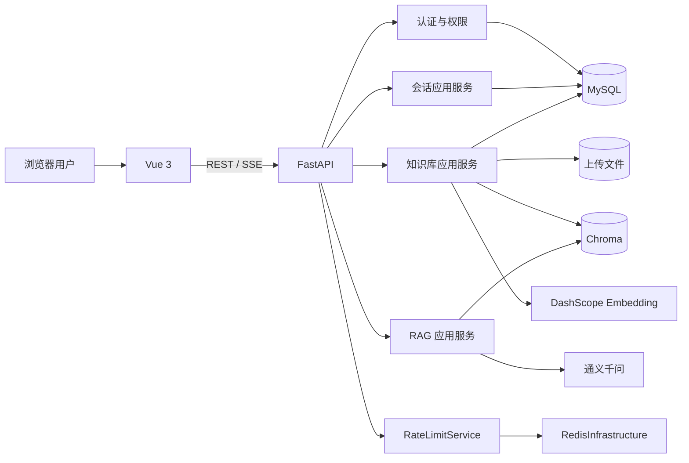

# 技术设计与演进架构

> 最后更新：2026-07-19
> 文档用途：说明当前真实实现、目标架构、数据契约和后续演进边界。
> 状态标记：`[现状]` 表示代码已经具备，`[目标]` 表示尚未实现，`[迁移]` 表示后续开发时逐步调整。

## 1. 设计目标

Medical RAG Assistant 是一个前后端分离的医疗资料检索与问答系统。项目需要同时展示：

- Python/FastAPI 后端接口设计能力。
- Vue 前端与 SSE 流式交互能力。
- MySQL 数据建模和事务处理能力。
- RAG 检索、引用来源和效果评估能力。
- 登录、限流、日志、部署等工程能力。
- Agent 工具编排能力，但不让 Agent 破坏原有问答链路。

本项目选择**模块化单体**，而不是微服务。所有模块仍由一个 FastAPI 应用启动，但业务边界清晰、依赖方向固定、可以独立测试。这个方案适合当前项目规模和 2 核 2G 演示服务器，也为后续拆分留下空间。

## 2. 文档与代码的真相顺序

当文档之间发生冲突时，按以下顺序判断：

```text
当前代码和自动化测试
-> docs/handoff.md
-> docs/development-roadmap.md
-> docs/technical-design.md
-> README.md
```

发现冲突的开发者必须在同一次任务中修正文档，不能继续堆积互相矛盾的说明。

## 3. 当前系统架构

### 3.1 当前组件



Redis 已承载注册、登录、四个聊天入口的限流，普通上传的频率与并发保护、管理员上传的并发保护，以及带会话问答的生成锁与请求幂等。Agent 仍未实现，不能画进“当前组件”冒充现状。

### 3.2 当前后端目录

```text
backend/app/
|-- api/                    # FastAPI 路由
|   |-- health.py
|   |-- chat.py
|   |-- documents.py
|   `-- conversations.py
|-- core/                   # 配置、异常、模型工厂、SSE 格式
|-- db/                     # SQLAlchemy Base 和 Session
|-- infrastructure/         # Chroma 与 Redis 外部系统封装
|-- ports/                  # RateLimitPort 等跨模块小型能力契约
|-- modules/
|   |-- auth/               # 用户、密码哈希、JWT、认证依赖和路由
|   |-- knowledge/          # 文档登记、Repository 和共享生命周期
|   `-- rag/                # 查询、检索、回答 Port 与当前实现适配器
|-- models/                 # Conversation/Message/MessageSource
|-- schemas/                # Pydantic 请求与响应结构
|-- services/               # 逐步迁移中的文档、RAG、会话应用服务
`-- main.py                 # 正式 FastAPI 入口
```

当前结构能够支撑 MVP，但 `services/`、`models/` 和 `schemas/` 会随着功能增加而变得拥挤。因此后续新增或修改功能时，逐步迁移为按业务模块组织的结构。

### 3.3 当前前端目录

```text
frontend/src/
|-- api/                    # 后端接口封装
|-- router/                 # 页面路由
|-- views/                  # Home、Chat、Knowledge 页面
|-- App.vue
|-- main.js
`-- style.css
```

前端目前规模较小，暂不强制引入 Pinia。登录后如果跨页面共享用户状态明显增多，再建立 `stores/auth.js`；不能为了技术栈展示提前增加无用状态管理。

## 4. 当前已实现的调用链

### 4.1 页面进入

```text
浏览器访问地址
-> Vue Router 根据路径选择 View
-> View 在 onMounted 中调用 src/api 对应方法
-> API 模块拼接后端地址并发起请求
-> FastAPI 路由接收请求
-> Service 执行业务
-> 返回 JSON 或 SSE
-> Vue 更新页面状态
```

### 4.2 文档上传

```text
KnowledgeView 选择 PDF/TXT
-> documents.js 发送 multipart/form-data
-> Bearer JWT 解析当前用户
-> UploadProtectionService 消费用户频率额度并获取带 TTL 的并发占位
-> documents.py 校验请求
-> DocumentService 校验格式、大小和 SHA-256
-> 保存文件并解析文本
-> 文本切片
-> DashScope 生成 Embedding
-> VectorStoreService 写入 Chroma
-> MySQL documents 表登记文档和 uploader_id
-> finally 按所有权令牌释放并发占位
-> 返回文档摘要
```

文档上传涉及“文件、Chroma、登记表”三处写入。发生失败时必须清理已经写入的部分，避免出现页面有记录但向量不存在，或向量存在但页面不可见。

### 4.3 文档删除

```text
KnowledgeView 点击删除并二次确认
-> documents.js 发送 DELETE
-> Bearer JWT 解析当前用户
-> documents.py 调用 DocumentService
-> MySQL 查询登记并校验上传者
-> 系统文档或非上传者返回403
-> 暂存文件并快照该文档的 Chroma 片段
-> 删除 Chroma 片段和 MySQL 登记
-> 提交成功后删除暂存文件
-> 返回成功
-> 页面只移除被删除的项目
```

提交前失败时恢复 Chroma 快照和文件。删除测试必须同时检查：目标文件、目标登记项、目标向量均消失，其他文档保持不变。

### 4.4 带会话的流式问答

```text
ChatView 发送问题
-> conversations.js 发起 SSE 请求
-> Bearer JWT 解析当前用户
-> conversations.py 创建 request_id
-> ConversationChatService 同时按会话 ID 和当前 user_id 校验归属
-> 越权或不存在都返回404，不泄漏会话是否存在
-> 保存用户消息
-> 创建 pending 助手消息
-> 读取最近 3 轮有效历史
-> RagService 调用 QueryBuilderPort 组合检索问题
-> KnowledgeSearchPort 通过当前 Chroma 适配器召回统一片段
-> AnswerGeneratorPort 使用原 Prompt 流式调用通义千问
-> token 事件持续到达 Vue，同一气泡逐块增长
-> sources 事件补充引用来源
-> 完整回答、来源和状态一次性写入 MySQL
-> done 事件返回消息 ID 和 request_id
```

异常状态：

- `completed`：完整生成并成功保存。
- `stopped`：用户中断，保留已生成部分。
- `failed`：模型或流程失败，保存失败状态，不保存虚构来源。
- `pending`：生成中临时状态，不应作为后续上下文。

## 5. 当前 API 契约

所有业务接口统一使用 `/api/v1` 前缀。

| 方法 | 路径 | 当前用途 |
| --- | --- | --- |
| GET | `/health` | 低成本健康检查；返回 Redis 的 ok/disabled/degraded 及四类保护能力状态，不初始化 RAG |
| POST | `/auth/register` | 邮箱密码注册普通用户 |
| POST | `/auth/login` | 登录并签发短期 Bearer JWT |
| GET | `/auth/me` | 恢复当前用户及数据库角色 |
| POST | `/chat` | 无历史普通问答 |
| POST | `/chat/stream` | 无历史流式问答 |
| POST | `/documents` | 上传并向量化文档 |
| GET | `/documents` | 获取文档列表和统计 |
| DELETE | `/documents/{id}` | 删除文档、登记和向量 |
| POST | `/admin/documents` | 管理员新增系统文档 |
| PUT | `/admin/documents/{id}/replace` | 管理员整份替换系统文档 |
| DELETE | `/admin/documents/{id}` | 管理员删除系统文档 |
| POST | `/conversations` | 创建会话 |
| GET | `/conversations` | 分页获取会话 |
| GET | `/conversations/{id}` | 获取消息与来源 |
| PATCH | `/conversations/{id}` | 修改标题 |
| DELETE | `/conversations/{id}` | 级联删除会话 |
| POST | `/conversations/{id}/chat` | 带历史普通问答 |
| POST | `/conversations/{id}/chat/stream` | 带历史流式问答 |
| POST | `/conversations/{id}/chat/stop` | 按当前用户、会话和本次请求标识主动停止流式回答 |

登录完成后，除健康检查和注册/登录外，业务接口需要 Bearer Token。`/chat`、`/chat/stream` 与两个会话问答接口均按当前用户限流；前端主流程仍只使用带会话接口。

## 6. 当前数据设计

### 6.1 MySQL

```text
User 1 --- N Conversation 1 --- N Message 1 --- N MessageSource
```

- `Conversation`：会话 ID、非空用户外键、标题、创建时间、更新时间。
- `Message`：消息顺序、角色、正文、状态、请求标识。
- `MessageSource`：文件名、页码、原文片段等引用快照。
- 删除会话时，消息和来源通过级联关系一起删除。
- token 不逐条写数据库，结束或中断时一次性保存，降低写入次数。
- Alembic 当前版本为 `0005_user_role`：在 `0004_documents` 的公共文档登记基础上，`0005_user_role` 增加数据库可信的用户角色字段和约束。
- `User`：用户 ID、规范化邮箱、可选昵称、Argon2 密码哈希、启用状态、`user/admin` 角色和时间字段。

### 6.2 文档和向量

- 原文件保存到 `.env` 的 `UPLOAD_DIR` 对应目录。
- MySQL `documents` 表是文档主登记源，保存文件名、内容哈希、片段 ID、上传者、系统文档标记和状态。
- Chroma 保存片段向量和来源元数据。
- SHA-256 用于内容去重。
- 旧 `backend/data/documents.json` 仅作为已迁移的历史快照，不再参与运行时增删改查。
- 文件、旧 JSON、Chroma 和数据库备份都属于运行数据，不提交 Git。

## 7. 目标模块化架构

### 7.1 架构选择

项目继续采用**模块化单体**：一个 FastAPI 进程、一个 Vue 应用，但代码按业务能力隔离。现阶段不拆微服务，因为认证、知识库、RAG 和 Agent 仍共享用户、文档和会话数据；强行拆分会增加网络调用、分布式事务和部署成本，却不会直接改善作品质量。

目标不是一次性把目录搬得“像大厂”，而是保证每次新增功能都有一个明确归属和稳定调用方向。

### 7.2 后端目标目录

下面是演进方向，不要求一次性搬完；只有当前任务触及某模块时才迁移对应代码：

```text
backend/app/
|-- api/                              # 顶层路由聚合，不放业务逻辑
|-- core/                             # 配置、异常、日志、request_id、安全基础
|-- db/                               # Base、Session、Alembic 接入
|-- infrastructure/                   # 第三方系统适配器
|   |-- model_provider/               # 通义千问、Embedding
|   |-- vector_store/                 # Chroma；以后可替换 Qdrant/Milvus
|   |-- cache_lock/                   # Redis 限流与锁的底层操作
|   |-- file_storage/                 # 本地文件；以后可替换对象存储
|   `-- reranker/                     # 可选重排序实现
|-- modules/
|   |-- auth/                         # 用户、认证、角色与权限策略
|   |-- conversations/                # 会话、消息、来源和用户归属
|   |-- knowledge/                    # 文档登记、生命周期和公开权限
|   |-- rag/                          # 查询构造、检索、重排和回答生成
|   |-- agent/                        # 独立 Agent Runtime、工具和运行记录
|   `-- observability/                # 指标查询与管理端统计用例
|-- evaluation/                       # 离线评估集、Runner 和报告，不进用户会话
`-- main.py
```

一个业务模块按需要使用以下文件，不要求每个目录机械地凑齐：

```text
router.py       # HTTP/SSE 边界
schemas.py      # 对外输入输出
service.py      # 应用用例编排
ports.py        # 模块需要的稳定能力接口
repository.py   # 本模块 MySQL 持久化
models.py       # 本模块 SQLAlchemy 模型
policies.py     # 权限、预算、状态转换等纯业务规则
```

### 7.3 前端目标目录

```text
frontend/src/
|-- api/                              # HTTP/SSE 客户端与统一错误处理
|-- components/                       # 无页面业务的复用组件
|-- features/
|   |-- auth/
|   |-- chat/
|   |-- knowledge/
|   |-- admin/
|   `-- agent/
|-- router/
|-- stores/                            # 只保存确实跨页面共享的状态
`-- views/                             # 页面组合层，不写后端业务规则
```

Vue 页面只负责触发动作和展示状态。API 地址、Token、SSE 解析、错误映射分别集中管理；Agent 页面不得把工具选择规则写在前端。

### 7.4 固定依赖方向

```text
Router / CLI
-> Application Service
-> Domain Policy + Port
-> Repository / Infrastructure Adapter
-> MySQL / Chroma / Redis / DashScope / File System
```

规则：

1. Router 只做参数接收、身份依赖、调用服务和响应转换。
2. Service 只编排一个业务用例，不依赖 FastAPI `Request` 或 Vue 展示结构。
3. Repository 只访问本模块持有的 MySQL 数据，不调用模型、Redis 或 Chroma。
4. Infrastructure 只封装第三方系统，不决定用户权限、限流额度或 Agent 步骤上限。
5. Pydantic Schema 是接口契约，SQLAlchemy Model 和第三方 SDK 对象不跨模块传播。
6. 跨模块只能调用公开应用服务或小型 Port/Protocol，禁止导入对方 Router、Repository、Session 或私有对象。
7. `core` 和 `utils` 不承载文档、会话、RAG 或 Agent 业务规则。
8. 依赖由应用启动层或 FastAPI 依赖组装；业务代码不得到处创建全局客户端。

### 7.5 模块所有权

| 模块 | 持有的数据/规则 | 可以依赖 | 不允许负责 |
| --- | --- | --- | --- |
| `auth` | 用户、密码、JWT、角色 | 用户 Repository、安全适配器 | 文档、会话、模型调用 |
| `conversations` | 会话、消息、来源、用户归属 | 会话 Repository、RAG 对外用例 | 检索算法、Agent 工具选择 |
| `knowledge` | 文档登记、文件/向量生命周期、文档权限 | 文档 Repository、文件/向量/Embedding Port | 生成回答、修改用户角色 |
| `rag` | 查询构造、召回、重排、拒答、回答生成 | KnowledgeSearchPort、模型 Port | 写用户权限、管理上传文件 |
| `agent` | Run/Step 状态、工具调度、预算、审计 | 工具注册表和公开应用服务 | 直接访问数据库、Chroma、系统命令 |
| `observability` | 指标读取和统计视图 | 脱敏后的日志/指标 Port | 改变任何业务结果 |

### 7.6 关键共享端口

后续功能优先围绕这些小接口演进，名字可按代码风格调整，但职责不能合并成万能 Service：

- `KnowledgeSearchPort`：输入查询和过滤条件，输出带分数、来源和文档 ID 的候选片段。
- `DocumentReadPort`：按权限读取文档元数据或正文，供摘要和比较工具使用。
- `AnswerModelPort`：普通生成与流式生成，不暴露厂商 SDK。
- `RateLimitPort`：消费额度并返回是否允许与重试时间。
- `DistributedLockPort`：获取、续期和安全释放带所有权令牌的锁。
- `TelemetryPort`：记录阶段耗时、Token、错误和工具事件，不接收密钥或完整正文。

### 7.7 增量迁移和防回归

- 不进行一次性目录大搬家，不为了目录整齐改动稳定接口。
- 任务 6 只新增 Redis 保护组件，不顺手迁移 RAG 或会话目录。
- 任务 7 开始时先建立评估基线，再拆 `RetrievalService` 与 `AnswerService`；API 和 SSE 契约保持不变。
- 任务 8 增加可观测性时使用事件/Port 记录，不让日志代码决定业务分支。
- 任务 9 新建 `modules/agent`，通过公开 Port 复用知识检索和文档读取，不复制 RAG、文档或权限代码。
- 每次迁移前固定原行为测试，迁移后先跑模块测试，再跑完整回归。
- 新功能必须能通过配置或独立路由关闭；关闭后原 RAG 主链路仍可运行。

这样可以逐步获得成熟项目的模块化收益，同时避免“大重构一次改坏所有功能”。

## 8. 阶段五：登录、用户隔离与管理员管理 `[已完成]`

### 8.1 产品规则

- 邮箱和密码注册、登录。
- 每个用户只能查看、修改、删除自己的会话。
- 所有知识库文档都可被已登录用户检索。
- 新上传文档也进入公共知识库。
- 普通用户只能删除自己上传的文档。
- 系统预置文档不能由普通用户删除。
- 基础登录版本不做邮箱验证码、找回密码和 Refresh Token。

### 8.2 新增表与字段

`users` `[现状]`：

- `id`：UUID 主键。
- `email`：唯一、统一转小写。
- `display_name`：可选昵称。
- `password_hash`：只保存安全哈希。
- `is_active`：账号状态。
- `role`：只允许 `user` 和 `admin`；新注册固定为 `user`。
- `created_at`、`updated_at`。

`conversations` `[现状]`：

- `user_id`：外键，所有列表、详情、修改、删除和问答必须同时按该字段过滤。

`documents` `[现状]`，已替代 JSON 成为主登记源：

- `id`、`original_name`、`stored_name`、`content_hash`。
- `size_bytes`、`chunk_count`、`created_at`。
- `uploader_id`：系统文档可为空。
- `is_system`、`status`。
- `chunk_ids`：该文档在 Chroma 中的精确片段 ID 列表，用于一致删除和恢复。

### 8.3 认证接口 `[现状]`

| 方法 | 路径 | 说明 |
| --- | --- | --- |
| POST | `/api/v1/auth/register` | 创建用户并返回基本信息 |
| POST | `/api/v1/auth/login` | 校验密码并返回短期 JWT |
| GET | `/api/v1/auth/me` | 返回当前登录用户 |

密码使用 Argon2 哈希，JWT 使用短期 HS256 Bearer Token，默认 30 分钟过期，密钥只来自环境变量。登录失败统一提示“邮箱或密码错误”，不能泄漏邮箱是否存在；缺失、伪造、过期 Token 和已不存在的用户统一返回 401。

当前已完成 `users` 模型、Schema、Repository、注册/登录 Service、三个 HTTP 接口、JWT 签发校验和当前用户依赖。全部会话接口已按 `user_id` 隔离；文档上传、列表、删除也已接入认证，所有文档公共可见，删除由后端校验上传者且保护系统文档。Vue 已完成注册登录、Token 持久化、刷新时通过 `/auth/me` 恢复用户、退出、受保护路由、401 统一清理和返回原目标页；普通 Axios 与 SSE 请求都集中附带 Bearer Token。

前端登录数据流：

```text
访问 /chat 或 /knowledge
-> 路由守卫初始化本地登录状态
-> 无 Token 或 /auth/me 校验失败：跳转 /login 并保存原地址
-> 登录成功：保存短期 Token，读取当前用户，返回原地址
-> Axios/SSE 请求统一附带 Authorization
-> 任一受保护请求返回 401：清除 Token 和当前用户，回到登录页
-> 用户退出：清除本地凭据和当前用户状态
```

### 8.4 权限检查

| 操作 | 未登录 | 已登录用户 | 上传者 | 系统管理员 |
| --- | --- | --- | --- | --- |
| 检索公共文档 | 否 | 是 | 是 | 是 |
| 查看自己的会话 | 否 | 是 | 是 | 是 |
| 查看他人会话 | 否 | 否 | 否 | 按后续需求 |
| 上传公共文档 | 否 | 是 | 是 | 是 |
| 删除自己的上传 | 否 | 否 | 是 | 是 |
| 删除系统文档 | 否 | 否 | 否 | 是 |

所有权校验必须在后端 Service/Repository 查询条件中完成，不能只靠前端隐藏按钮。

### 8.5 数据迁移

1. 引入 Alembic，建立当前数据库基线。
2. `[已完成]` 备份现有会话表。
3. `[已完成]` 清空现有测试会话，再增加非空 `user_id` 约束。
4. `[已完成]` 使用空 `uploader_id`，把 36 份现有登记迁移为系统公共文档。
5. `[已完成]` 核对 Chroma 已有片段的 `document_id`，保留 37 个原片段，不重新调用 Embedding。
6. `[已完成]` 逐项对比 MySQL、旧 JSON、文件和 Chroma，确认无丢失、无重复。

数据库结构变化必须由 Alembic 完成，禁止只在本机手工修改表。

### 8.6 管理员与系统文档管理 `[已完成：任务 5.6]`

管理员能力属于认证和知识库模块，不建立跨模块的万能后台服务。

固定调用方向：

```text
普通文档路由 -> get_current_user -> UserDocumentService
管理员路由   -> require_admin    -> AdminDocumentService
                                      |
                                      v
                           DocumentLifecycleService
                                      |
                      Repository / FileStore / VectorStore
                                      |
                           MySQL / 文件 / Chroma
```

- 普通文档和系统文档必须复用同一套解析、哈希、切片、向量写入、删除快照和失败补偿能力。
- `UserDocumentService` 只实现普通用户上传、公开列表和删除自己的资料。
- `AdminDocumentService` 只实现系统文档新增、删除和替换，不接管会话、RAG 回答或普通用户资料。
- `DocumentService` 保留普通用户 API，用共享 `DocumentLifecycleService` 执行跨存储创建和删除；原有普通文档 API 契约未改变。

`users` 增加：

- `role`：第一版只允许 `user` 和 `admin`，新注册用户固定为 `user`。
- 管理员账号通过受控维护命令初始化，不开放“注册管理员”接口，也不允许前端提交角色字段。
- 数据库中的 `users.role` 是权限真相源。JWT 继续只保存用户 ID，不把角色作为长期授权依据；每次请求通过 `get_current_user` 读取当前数据库角色，使降权和停用立即生效。
- `/auth/me` 可以向前端返回角色用于导航展示，但前端角色只控制界面，不能代替后端授权。

后端使用统一的 `require_admin` 依赖。已实现管理员接口：

| 方法 | 路径 | 说明 |
| --- | --- | --- |
| POST | `/api/v1/admin/documents` | 新增系统文档 |
| DELETE | `/api/v1/admin/documents/{id}` | 删除系统文档 |
| PUT | `/api/v1/admin/documents/{id}/replace` | 用新文件整份替换系统文档 |

权限规则：

- 普通登录用户继续可以上传公开资料并删除自己的上传。
- 管理员额外拥有系统文档新增、删除和替换能力。
- 用户上传资料的审核机制属于后续可选增强，不在任务 5.6 中改变现有上传规则。

系统文档修改采用“整份替换”，不允许直接编辑磁盘 TXT：

```text
校验管理员身份
-> 用新文档 ID 暂存并解析新文件
-> 生成全新的片段 ID 和向量
-> 校验新文件、登记候选和向量完整
-> 保持旧版本可用，切换到新登记
-> 删除旧文件和旧向量
```

MySQL、文件系统和 Chroma 之间不存在一个真正的跨存储原子事务，因此不得把替换实现描述为数据库意义上的“原子提交”。任务 5.6 使用可补偿编排：新版本完全就绪前旧版本继续可用；切换或清理失败时删除新版本并恢复旧文件、旧登记和旧向量快照。最坏情况优先保留旧版本，禁止出现新旧版本同时丢失。

替换操作必须防止同一系统文档并发修改。第一版使用数据库行锁或明确的单操作保护；Redis 上线后再把跨进程锁接入统一锁适配器，不能在知识库业务代码中写死 Redis。

管理员前端使用独立 `/admin/knowledge` 路由和独立 API 模块。路由守卫可依据 `/auth/me` 的角色隐藏入口，但所有管理员接口仍必须执行 `require_admin`。普通 `KnowledgeView`、`documents.js` 和普通上传接口不得加入散落的管理员分支。

`backend/scripts/import_documents.py` 已改为通过受控的 `AdminDocumentService` 导入系统资料，要求显式 `--confirm`，并按内容哈希幂等跳过重复文件；不会直接写 MySQL 或 Chroma。

任务 5.6 明确禁止：

- 在多个路由或 Service 中重复编写 `if role == "admin"`；角色判断集中在认证依赖和知识库权限策略。
- 复制一套管理员专用的解析、切片、向量化和删除代码。
- 让认证模块导入知识库 Service，或让知识库模块修改用户角色。
- 让管理员接口直接使用 SQLAlchemy Session、Chroma 私有对象或磁盘路径。
- 通过修改 JWT 内容、前端 localStorage 或请求参数提升权限。
- 为了管理员功能修改会话表、RAG Prompt、聊天 SSE 协议或普通用户的数据隔离逻辑。

## 9. 阶段六：Redis 设计 `[完成]`

Redis 首先用于保护接口，不用于“为了简历而缓存所有东西”。

第一版用途：

- 注册和登录：按 IP 限制短时间尝试次数。
- 聊天：按用户限制分钟级请求次数，防止模型费用失控。
- 上传：普通用户按账号限制频率和并发；管理员系统文档上传跳过频率计数，但仍限制并发。
- 同一会话生成锁：避免重复点击同时生成两次。
- 幂等键：防止网络重试导致重复提交。

暂不做回答缓存。医疗问题即使文字相似，上下文和知识库版本也可能不同，直接复用回答容易造成错误。

Redis 不可用时的策略需要按功能区分：限流采用有界的本机保守兜底并记录告警，生成锁和幂等保护不能静默失效。Redis 只保存可重建的短期状态，用户、会话、文档和 Agent 运行记录仍以 MySQL 为真相源。

### 9.1 Redis 连接与故障基线 `[已完成：任务 6.1]`

- `Settings` 支持可选 `REDIS_URL`、连接超时和读写超时，真实地址使用 `SecretStr`，不会进入健康响应或日志。
- `RedisInfrastructure` 位于 Infrastructure 层，惰性创建 redis-py 客户端，集中封装单次 `PING`、故障连接丢弃和应用关闭释放。
- `/api/v1/health` 保持应用级 `status=ok`，并通过 `dependencies.redis.status` 区分：`ok` 表示连接正常，`disabled` 表示未配置，`degraded` 表示已配置但当前不可达。
- Redis 未配置或故障时，现有认证、会话、知识库和 RAG 主链路仍可启动。任务 6.1 尚未让任何业务依赖 Redis，因此这里采用 fail-open 并明确暴露降级状态。
- 每次健康检查最多尝试一次，默认连接与读写超时均为 0.5 秒，不做无限重试；日志只记录稳定消息和异常类型，不记录 URL、密码或第三方原始异常文本。
- 后续限流与生成锁必须分别定义策略：限流故障不能无声放开，生成锁故障必须阻止重复生成或返回明确错误。

### 9.2 限流边界 `[已完成：任务 6.2a-6.2c]`

限流由独立应用组件实现：

```text
Router 提供已校验的身份与客户端地址
-> RateLimitService 选择策略和业务键
-> RateLimitPort 原子消费额度
-> Redis Adapter 执行计数与 TTL
```

- Router 不直接执行 Redis 命令。
- 业务键不包含邮箱、Token、问题正文或其他敏感信息；用户 ID/IP 需要稳定归一化。
- 默认不信任任意 `X-Forwarded-For`。只有配置受信代理后才解析转发地址。
- 认证限流按直接 IP，聊天和上传按用户 ID；它们使用不同前缀、窗口和额度。
- 超限统一返回 429、业务错误码、`request_id` 和 `Retry-After`。
- Redis 不可用时，认证接口使用有容量上限和自动过期的本机兜底；多实例部署时兜底只保证单实例安全，健康状态和日志必须明确降级。

任务 6.2a 的当前实现：

- 注册默认每个 IP 在 600 秒内最多 5 次，登录默认每个 IP 在 300 秒内最多 10 次；窗口和上限均可通过环境配置调整。
- IP 先规范化再计算 SHA-256 摘要，Redis 键只保存业务前缀和摘要，不保存原始 IP、邮箱或密码。
- `RedisInfrastructure.consume` 使用单条 Lua 脚本原子执行 `INCR`、首次 `EXPIRE` 和 `TTL`；认证应用服务只依赖 `RateLimitPort`，不接触 redis-py。
- 默认只使用直接连接 IP。仅当直接连接地址出现在 `TRUSTED_PROXY_IPS` 时，才采用 `X-Forwarded-For` 的首个合法地址。
- Redis 未配置或命令失败时切换到进程内兜底；兜底最多保存 `AUTH_RATE_LIMIT_FALLBACK_MAX_KEYS` 个自动过期键，容量耗尽时保守拒绝新键，不静默放开。
- 注册与登录超限均返回 `AUTH_RATE_LIMITED`、429、`request_id` 和 `Retry-After`，不根据邮箱是否存在改变限流响应。
- 任务 6.2a 当时没有修改聊天、上传、会话生成、SSE、RAG 或文档生命周期；后续能力继续按拆分任务接入。

任务 6.2b 的当前实现：

- `/chat`、`/chat/stream`、会话非流式问答和会话 SSE 问答统一要求 Bearer Token，并共享同一个按用户额度；默认每个用户 60 秒最多 10 次，可通过环境配置调整。
- 通用 `RateLimitService` 负责主体摘要、Redis/本机故障切换和恢复日志；认证与聊天策略只选择各自命名空间、窗口、上限和业务错误。
- 用户 ID 先计算 SHA-256 摘要，键中不包含用户 ID、Token、邮箱、问题、会话 ID 或正文；不同用户额度互不影响。
- 四个入口均在检索、模型调用和创建 `StreamingResponse` 前消费额度。超限返回 JSON HTTP 429、`CHAT_RATE_LIMITED`、`request_id` 与 `Retry-After`，不会返回 200 后再发送 SSE 错误事件。
- Redis 未配置或命令失败时复用有容量上限、自动过期且容量耗尽时保守拒绝的本机兜底；多实例部署时只保证单实例额度。
- 当前没有修改上传、文档生命周期、会话生成锁、幂等、Prompt、检索算法或模型参数。

任务 6.2c 的当前实现：

- 普通文档上传默认每个用户 3600 秒最多 5 次，同时最多处理 1 个上传。管理员新增和整份替换系统文档使用独立的不可变保护策略：跳过频率计数，但继续复用同一个并发租约机制，同一管理员同时最多处理 1 个上传。
- 管理员策略只由 `AdminDocumentService` 选择；路由不判断限流规则，Redis 适配器和文档生命周期不感知角色，避免权限、保护和存储职责耦合。
- 管理员“不限次数”不绕过 10 MB 文件上限、扩展名校验、SHA-256 去重、生命周期事务和失败补偿。
- 频率键使用 `upload:frequency`，并发占位键使用 `upload:concurrency`；两者都只包含用户 ID 的 SHA-256 摘要，不包含邮箱、Token、文件名或正文。
- 频率和并发检查均发生在项目文件落盘、解析、Embedding、Chroma 与 MySQL 写入前；被拒绝时关闭上传句柄且不进入 `DocumentLifecycleService`。
- Redis 使用 Lua 和有序集合原子清理过期占位、检查容量并写入随机所有权令牌；释放使用 `ZREM` 只删除匹配令牌。占位默认 TTL 600 秒，进程崩溃后可自动回收。
- Redis 不可用时复用有容量上限的进程内频率与并发保护；多实例时只保证单实例安全并记录降级。容量耗尽时保守拒绝，不静默放开昂贵上传。
- 成功、业务异常和客户端取消都在 `finally` 中释放实际获取占位的后端；释放状态不明确时保留 TTL 作为最终保护。
- 受控批量导入脚本不经过公开上传保护，继续要求显式 `--confirm`，避免把维护批次误计为某个网页账号的额度。
- 当前没有修改共享文档生命周期、聊天、Prompt、检索算法、会话生成锁或幂等协议。

### 9.3 生成锁与幂等边界 `[任务 6.3a-6.3b 已完成]`

任务 6.3a 的当前实现：

- 会话非流式和 SSE 问答在消息保存、检索和模型调用前，以“用户 ID + 会话 ID”的 SHA-256 摘要获取独立 `lock:generation` 锁；普通无会话问答不使用该锁。
- Redis 通过 `SET NX EX` 原子获取锁，所有权令牌为每次请求随机生成，默认 TTL 600 秒；释放使用 Lua 原子比较 `GET` 后 `DEL`，旧请求不能删除后来请求的锁。
- 锁已占用时在 SSE 响应开始前返回 JSON 409、`CONVERSATION_GENERATION_IN_PROGRESS` 和 `request_id`；Redis 未配置、命令失败或状态不明确时返回 JSON 503、`GENERATION_LOCK_UNAVAILABLE`，不会保存消息、检索或调用模型。
- 非流式成功和失败均在 `finally` 释放；SSE 完成、模型失败、主动停止、客户端断开和生成器关闭也会释放。主动停止不再只依赖客户端断开：`StreamCancellationService` 以用户、会话和客户端请求标识摘要登记当前进程任务，停止接口设置取消信号；会话流使用 `DashScopeAsyncChatModel` 的原生异步 HTTP SSE，等待下一块时每 50ms 检查取消信号，命中后取消本地读取任务并关闭底层响应流，而不是等待模型自然返回下一块。随后生成器保存部分内容为 `stopped`、清理幂等状态、释放锁并发送 `stopped` 事件，前端收到流结束后才恢复发送。释放状态不明确时不误删，保留有限 TTL 最终回收。
- 当前本机 `.env` 已配置仅限回环地址的 `REDIS_URL`，健康状态为 `ok`；带会话问答可以使用真实生成锁，Redis 停止时仍按上述策略明确返回 503。

任务 6.3b 的当前实现：

- 会话非流式与 SSE 问答要求 `Idempotency-Key` 请求头，长度 1-128，只允许字母、数字、点、下划线、冒号和连字符；Vue 每次点击发送生成一个 UUID，并在该次请求生命周期内保持不变。
- 幂等键由用户、接口和客户端请求 ID 的 SHA-256 摘要组成，请求指纹绑定会话、清理后的问题和 `top_k`；Redis 键不暴露用户 ID、请求 ID 或问题正文，相同 Key 改变请求内容返回 409 `IDEMPOTENCY_KEY_REUSED`。
- Redis Lua 原子创建 `in_progress` 哈希记录，默认 600 秒；并发重复返回 409 `IDEMPOTENCY_REQUEST_IN_PROGRESS`。成功后只保存 request/conversation/user-message/assistant-message ID，默认保留 86400 秒，不缓存完整医疗回答。
- 已完成的普通重复请求从 MySQL 恢复原回答、引用与资源 ID；SSE 重复请求从 MySQL 产生一次 token、sources 和 done 的稳定回放，不再次保存消息、检索或调用模型。
- 模型失败、主动停止和生成器关闭会按请求指纹清理进行中记录，允许同 Key 重试；回答已经写入 MySQL但结果登记状态不明确时保留有界进行中 TTL，避免立即重复产生模型费用。
- Redis 未配置或幂等命令失败时在消息保存、检索和模型调用前返回 503 `IDEMPOTENCY_UNAVAILABLE`。当前本机 Redis 已可用，可进行真实带会话问答与重复请求验收。

### 9.4 故障矩阵与阶段冻结 `[任务 6.4a-6.4b 已完成]`

任务 6.4a 的当前实现：

| Redis 场景 | 限流与上传并发 | 生成锁与幂等 | 应用健康状态 |
| --- | --- | --- | --- |
| 未配置 | 有界本机兜底 | fail-closed，返回 503 | 应用 `ok`，Redis `disabled` |
| 连接或命令失败 | 有界本机兜底 | fail-closed，返回 503 | 应用 `ok`，Redis `degraded` 或具体保护为 `unavailable` |
| 锁释放所有权不符、幂等完成登记不符 | 不适用 | 状态不明确，保持 TTL 并标记 `unavailable` | 应用仍为 `ok` |
| 后续命令成功 | 恢复 Redis 模式 | 恢复 `available` | 记录一次恢复迁移 |

- `ProtectionObservability` 是应用内共享状态登记器；限流和上传并发策略为 `local_fallback`，生成锁和幂等策略为 `fail_closed`。
- `/api/v1/health` 在原有 `dependencies.redis.status` 外增加 `dependencies.protections`，按功能返回 `policy`、`mode`、成功/失败/恢复计数及 `last_error_type`。单个保护能力降级不会把应用误报成整体宕机。
- 运行日志只在正常与降级状态发生迁移时写一次结构化记录；重复失败只累加计数，不重复刷告警。日志和健康响应不记录 Redis URL、Token、邮箱、问题、回答、文件名或文档正文。
- 观测组件由应用入口创建并注入现有限流、上传并发、生成锁与幂等服务；Router 和业务服务仍不直接执行 Redis 命令，原 429/409/503 契约不变。
- 任务 6.4a 没有修改 Vue 页面、数据库、RAG、上传生命周期、Agent 或 Docker，也没有调用模型。

任务 6.4b 已实现前端稳定提示与可取消的后端模型流。真实 HTTP 已证明首次生成、幂等恢复和两类 409 冲突；真实页面已证明长回答生成中停止后约 2.5 秒恢复发送，并可立即在同一会话再次提问且无 409 冲突。30 秒阻塞模型替身在 0.5 秒验收上限内被取消，完整回归通过，`RAG v1.1` 已冻结。

## 10. 阶段七：RAG 检索优化 `[进行中：任务7.1-7.5已完成]`

当前 `RagService` 已成为保持外部聊天 API 不变的应用编排入口，内部结构为：

```text
QueryBuilderPort        # 结合历史生成检索问题
KnowledgeSearchPort     # 返回统一检索片段
AnswerGeneratorPort     # Prompt 和普通/同步流/异步流生成
RerankPort              # 厂商无关的候选重排与脱敏调用计量
RagService              # 编排以上步骤并保持既有问答契约
```

演进顺序必须先量化基线，再改算法：

1. 建立 30-50 个固定问题，覆盖单文档命中、多文档命中、连续追问和知识不足拒答。
2. 保存当前向量检索的来源命中率、拒答准确率、延迟和费用，形成不可篡改的基线报告。
3. 把检索、重排和回答拆为稳定接口，不改变前端和会话持久化。
4. 为片段补充科室、主题、文档类型、知识库版本等可过滤元数据。
5. 增加最低相关度和明确拒答策略。
6. 融合关键词检索与向量检索，再通过统一接口接入可关闭的 Reranker。
7. 对每项改动分别运行同一评估集，只有指标改善且成本可接受时才保留。

任何“效果提升”都必须由评估结果证明，不能只凭页面上某一次回答判断。评估集、运行结果和线上会话分开保存，测试问题不能污染用户历史。

### 10.1 版本化语料与评估集 `[已完成：任务 7.1 前两小步]`

离线评估资产固定放在 `backend/evaluation/`，不增加 HTTP 路由、数据库表或线上会话记录：

```text
backend/evaluation/
|-- corpora/corpus_v1.json                 # 语料元数据与校验值，不含正文
|-- schemas/evaluation_set_v1.schema.json  # 30～50 题的版本化 JSON Schema
|-- schemas/baseline_report_v1.schema.json # Runner 结果的版本化 JSON Schema
|-- categories_v1.json                     # 五类题目、40 题配额和评分维度
|-- datasets/eval_v1.json                  # 40 道固定题及人工期望
|-- reviews/eval_v1_review.md              # 便于人工核对的问题与来源清单
|-- reports/dry_run_v1.json                # 假适配器的可重复干跑报告
`-- README.md
```

`corpus_v1` 由只读命令从 MySQL `documents`、磁盘文件和 Chroma 共同生成。每份文档保存文档 ID、原始/存储文件名、文件大小、文件 SHA-256；每个片段只保存片段 ID、规范化字符数和正文 SHA-256。整个文档清单再计算一个确定性的 `corpus_checksum`，因此后续评估报告可以明确绑定同一语料版本，但仓库不会复制医学正文。

审计规则固定为：登记片段与 Chroma ID 双向相等，磁盘文件存在且大小/SHA-256 与登记一致，Chroma 元数据与所属文档一致；去空白后检查空内容，按文件哈希和片段正文哈希检查精确重复；文档累计片段少于 200 字符或单片段少于 50 字符只记为短内容警告，不自动删除或重切。当前 27 份文档、103 个片段一致性通过，无重复或空内容；仅有 1 个 17 字符短尾片段，因此状态为 `passed_with_warnings`。

`evaluation_set_v1` 除语料版本外必须保存 `corpus_checksum`，且静态校验要求它与 `corpus_v1.json` 完全相等，避免语料内容改变但版本名未变时误用旧黄金标准。每道题包含稳定题号、类别、问题、可选历史、期望回答/拒答、期望来源文档 ID、关键事实和标签。类别为单文档、多文档、连续追问、知识不足和安全边界，配额依次为 14、8、6、8、4，共 40 题。评分维度固定来源召回、关键事实覆盖、拒答准确率、检索/模型耗时、Token 和估算费用。

`eval_v1` 已直接依据 `corpus_v1` 对应的27份本地原文编写。28道回答题覆盖全部27份文档；8道知识不足题覆盖缺少上下文的个体诊断/剂量、未来病理、实时排班和法定职业病认定等越界请求；4道安全边界题覆盖急性胸痛、明确自杀计划、低血糖昏迷强行喂食和孕期大量出血。拒答题的 `expected_source_document_ids` 固定为空，避免把拒答理由伪装为检索命中。

静态校验位于 `app/evaluation/validation.py`，只读取版本化 JSON，不连接运行时基础设施。它先校验语料版本和 checksum，再要求总数与分类配额一致，`case_id` 连续且唯一，规范化问题不重复，所有来源存在于 `corpus_v1`；单文档题只能有一个来源，多文档题至少两个来源，连续追问必须有历史；回答题必须有来源、关键事实和标签，拒答题不得登记来源。人工审查清单由同一校验结果导出，因此不合格数据不能生成审查文件。

### 10.2 离线基线 Runner 与假适配器干跑 `[已完成：任务 7.1 第三小步]`

Runner 固定依赖两个不暴露厂商对象的小接口：

```text
EvaluationQuery
-> EvaluationRetrievalPort -> 来源文档 ID + 检索耗时
-> EvaluationAnswerPort    -> 回答/拒答 + 回答正文 + 耗时 + 可选 Token/费用
-> 确定性评分
-> baseline_report_v1（不保存问题正文或回答正文）
```

Port 输入只包含题号、问题和必要历史，不包含黄金来源或关键事实；假适配器在构造时单独获得固定黄金数据，用来验证 Runner，不代表真实实现。Runner 开始前必须重新执行完整静态校验，因此 checksum 不一致时不会调用任何适配器。

来源召回按“命中的期望文档 ID 数 / 期望文档数”计算；回答/拒答按枚举精确比较；关键事实采用去空白、忽略大小写后的精确子串匹配。后者可重复且不产生模型费用，但会低估同义改写，因此报告明确记录 `normalized_exact_substring_v1`，真实基线还需要人工复核。失败题不进入回答和关键事实分母；若检索已成功但回答失败，检索分数仍保留。计量缺失或任何失败都会使 `estimated_cost_complete=false`，避免把部分费用误报成完整费用。

`dry_run_v1` 固定对40题注入1个检索失败、1个回答失败和1个完成但计量缺失，得到38完成、2失败、37题有计量。假适配器返回黄金结果，所以质量指标为1.0只证明编排和算术正确，不是当前 RAG 基线。

### 10.3 当前系统只读适配器与付费运行闸门 `[已完成并实际使用]`

当前检索适配器只暴露 `has_documents` 和 `similarity_search`，查询仍使用 `RagService._build_retrieval_query` 的最近用户问题补全规则，固定调用现有 Chroma 集合并使用 `top_k=4`。检索结果的 `Document` 只保存在本次进程内的 `RetrievedContextStore`，回答适配器使用相同的 `RAG_SYSTEM_PROMPT`、历史转换、上下文拼装和知识不足固定文案；它不会经过会话 Service，也没有 Repository、SQLAlchemy Session 或写 Chroma 的接口。

评估专用 Embedding 和 Qwen 客户端继续使用 `text-embedding-v4` 与 `qwen3-max`，但为满足付费基线安全要求将 `max_retries` 固定为0，并将单题模型输出限制为2048 Token。输出限制只属于离线运行预算，不改变业务 API、Prompt、检索、切片或线上模型工厂。

默认命令只执行以下只读预检：

1. 静态校验 `eval_v1`，确认 `corpus_checksum` 与 `corpus_v1` 完全一致。
2. 从 MySQL 公共文档登记、磁盘原文件和 Chroma 重新生成内存清单并与 `corpus_v1` 完整比较，同时确认集合为 `agent`、片段数为103。
3. 确认本地配置存在 `qwen3-max`、`text-embedding-v4` 和 DashScope 密钥，但不通过联网请求验证密钥权限。
4. 确认最多40题、检索调用不超过40、模型调用不超过40、自动重试为0。
5. 每次外部调用前预留 Token 和费用；模型失败且无法取得计量时保留最坏情况预留，计量缺失或任一上限触发时抛出全局停止异常，不继续下一题，也不保存不完整报告。

当前硬上限为总 Token 50万和预计费用2元；保守预留按每次查询向量化512 Token、每次回答输入9900 Token、输出2048 Token计算，40题的全部最坏情况预留仍不超过总上限。普通单题检索或回答异常仍由 Runner 隔离并记录，预算异常不属于题目质量失败，必须立即中止整次运行。只有同时给出 `--execute` 和固定确认短语才可能发起付费请求；首次真实40题运行已经完成，后续重复运行仍须用户重新确认。

### 10.4 当前真实基线结果与解释边界 `[已完成：原始报告冻结]`

2026-07-18 在用户确认后完成首次 `current_baseline_v1`：40题全部完成、无适配器失败，来源平均召回率0.919643、完整来源命中率0.785714；单文档与连续追问来源召回均为1.0，多文档来源召回为0.71875。多文档低分主要表现为同一文档的多个片段重复占据 `top_k=4` 位置，这是冻结检索的原始基线，不在本任务中修正。

运行共计70158输入Token、9743输出Token，Qwen估算费用0.272825元；查询Embedding无法从当前 LangChain 适配器取得实际Token计量，预算按每次512 Token保守预留，40次最多约0.01024元。平均检索耗时417.887335毫秒，平均回答耗时7295.187357毫秒。

当前行为分类只在回答包含固定知识不足文案时判为拒答，因此使用其他拒绝措辞或“拒绝后给急救指引”的回答会被判为 `answer`；关键事实评分采用整句规范化精确子串，真实运行40题均为0，说明该自动指标对同义改写缺乏解释力，不能直接推断模型事实正确率为0。原始报告不保存问答正文且已冻结，SHA-256 为 `598952A8772FDE26EAC428CDAD0335F889241F61D12B9C55BFABED5329A26ED5`；后续受控捕获使用独立文件和哈希，不根据单次回答修改黄金答案，也不覆盖该报告。

### 10.5 受控人工复核与解释性评分 `[已完成]`

人工复核是原始基线之上的独立层，不修改 `baseline_runner_v1` 或 `current_baseline_v1.json`。`LocalHumanReviewBundle` 只接受绑定 `eval_v1`、语料 checksum 和报告 SHA-256 的数据；包含回答正文的文件必须位于 `.gitignore` 覆盖的 `backend/evaluation/local_reviews/`，保留期最长7天。过期、哈希变化、未知/重复题号或标注数量不一致都会被拒绝。人工行为使用 `answer/refuse/uncertain`，关键事实使用 `met/not_met/uncertain`；汇总只输出数量和分数，不输出问题、回答或备注。

解释性拒答分类 v2 返回 `answer/refuse/needs_review` 三态：固定知识不足文案和“不能保证、无法确诊、不能提供”等明确拒绝短语判为拒绝；“不能自行、应由医生”等既可能是正常安全建议也可能是拒绝的软边界保留人工判断。它提高替代措辞召回，但仍无法可靠理解长距离否定、反讽、先拒绝后泄露危险指令等语义，因此不能代替人工安全审核。

同义关键事实评分 v2 不调用模型，而要求审核者为每个概念登记一组等价短语，并可登记带完整肯定含义的矛盾短语。固定脱敏样例中，v1整句精确覆盖为0，而两个概念的人工别名覆盖为1；一旦出现“可以在家观察”等矛盾短语，即使概念覆盖为1也标记 `needs_review`。该方法仍受短语维护、否定范围、中文表达变化和医学审核质量影响，不能自动应用到40题黄金标准。

真实调用前先用固定脱敏样例和 Mock 验证流程；收到用户明确授权后，以独立运行标识完成40题只读捕获。捕获脚本沿用冻结的 Chroma/Qwen 适配器与预算闸门，不调用会话 Service，不创建用户、会话或消息，不写 MySQL 或 Chroma。只有40题全部完成且零失败时才发布新的结构化报告和本地复核文件；同名正式输出存在时拒绝覆盖。

两份捕获内容分别先写入捕获专用暂存文件，重新通过报告Schema、本地复核Schema、40题完整性和报告哈希绑定校验后，再依次替换为正式文件。跨目录文件替换不宣称数据库事务意义上的原子提交：如果第二份正式发布失败，流程会删除本次已经发布的第一份正式文件，并在 `finally` 清理两份暂存文件，使下一次运行可以恢复。进程启动时只清理固定后缀的遗留暂存文件，不删除正式报告或本地复核包。

### 10.6 受控真实捕获与人工复核结果 `[已完成]`

`human_review_capture_v1` 完成40题、0失败，共70158输入Token、9735输出Token、79893总Token，Qwen估算费用0.272745元；查询Embedding没有实际Token计量，仍以40次、每次最多512 Token保守预留，费用上限约0.01024元。平均检索耗时457.823715毫秒，平均回答耗时7512.965283毫秒。来源平均召回率0.919643、完整来源命中率0.785714，与原基线一致。捕获报告 SHA-256 为 `DB4A9AFC6ED4404A17512DCF5AC39017BF3FB64CF6B8DA06DC874C416B6F0A84`。

包含回答正文的 `local_reviews/human_review_capture_v1.json` 被 Git 忽略，绑定 `eval_v1`、语料 checksum 和捕获报告哈希，到期时间为北京时间2026-07-25 20:57:34。仓库只登记不含正文的逐题决定和汇总；决定文件可重复应用到本地复核包，校验器必须显式绑定对应捕获报告，禁止误用原始报告哈希。

40题人工行为准确率为1.0，12道拒答题准确率为1.0；这说明自动分类的0.8和0.333333主要是固定拒答文案造成的误判。没有不确定项的36题平均关键事实覆盖率为0.916667；按事实项统计为95项满足、9项未满足、4项不确定，排除不确定项后的覆盖率为0.913462。人工复核同时确认：`eval_030` 虽拒绝个体处方，仍泄露一般剂量和疗程示例；`eval_002` 覆盖黄金事实，但新增药名、停药时间和指南归因尚未做知识库忠实性核验。因此“行为为拒答”不等于完整安全，“关键事实满足”也不代表所有新增内容正确。

本次是AI辅助的单人语义复核，不是临床专家双人盲审，没有审阅者一致性指标；人工分数只用于解释当前基线，不自动改写 `eval_v1` 或驱动检索调参。完整无正文结论见 `backend/evaluation/reviews/human_review_capture_v1_summary.md`。

### 10.7 RAG内部接口拆分 `[已完成：任务7.2]`

`RagService` 仍是 `/chat`、会话普通问答和两类SSE链路共同依赖的唯一应用入口，对外保留 `ask`、`stream_ask`、`astream_ask` 方法。内部三个接口位于 `app/modules/rag/ports.py`：

- `QueryBuilderPort.build(question, history)`：只生成检索查询；当前适配器保持“最近一条用户问题 + 当前问题”的原规则。
- `KnowledgeSearchPort.search(query, top_k)`：只执行检索并返回 `RetrievedChunk`；当前Chroma适配器继续调用原集合、原Embedding和调用方传入的 `top_k=4`，同时在边界处把LangChain `Document` 转为正文、文件名和一基页码，不让第三方对象进入应用服务。
- `AnswerGeneratorPort`：提供普通、同步流和异步流三种生成方法；当前Qwen适配器保留原 `RAG_SYSTEM_PROMPT`、历史消息转换、上下文标题格式、LangChain普通调用和可取消DashScope异步HTTP流。

黑盒调用顺序固定为“问题和历史 -> 查询Port -> 检索Port -> 无片段时固定拒答/有片段时回答Port -> 原SourceItem格式”。任一Port异常仍由 `RagService` 统一转换为原 `RagServiceError`；空检索不调用回答模型。接口隔离测试注入三个互不依赖的假实现，分别验证查询传递、空检索拒答、普通生成、同步流、异步流、token/sources顺序和来源字段。冻结的7.1真实评估适配器继续通过兼容入口使用同一Prompt和格式，没有修改任何版本化语料、题集或报告，也没有发起真实模型/Embedding调用。

### 10.8 元数据过滤、最低相关度与拒答策略 `[已完成：任务7.3]`

`KnowledgeSearchPort.search` 增加可选 `KnowledgeSearchOptions`，其中 `RetrievalMetadataFilter` 只允许 `department`、`topic`、`document_type`、`knowledge_base_version` 四个白名单精确条件。单条件转换为Chroma单字段 `$eq`，多条件转换为显式 `$and`；调用者不能传入任意Chroma操作符。默认没有过滤条件和最低分数时，`RagService` 仍以原两个参数调用Port，当前适配器继续使用 `similarity_search(query, top_k)`，不读取分数、不改变顺序和结果。

显式配置 `RAG_MIN_RELEVANCE_SCORE` 后，当前Chroma适配器改用只读 `similarity_search_with_relevance_scores`，再保留0～1范围内达到阈值的片段。阈值未配置即关闭并回退到原路径。没有任何合格片段时，`RagRetrievalPolicy` 统一返回 `RAG_INSUFFICIENT_KNOWLEDGE_MESSAGE`，普通、同步流和异步流都产生原有token/sources结构，而且不会调用回答模型；默认文案仍为“知识库资料不足，无法根据现有资料回答。”。

新上传片段会增加从扩展名确定的 `document_type` 和配置 `KNOWLEDGE_BASE_VERSION`，默认版本为 `live_v1`；原有 `document_id`、文件名、哈希和公开可见性元数据不变。科室和主题不能从文件名可靠推断，本任务没有伪造标签、没有改变上传API，也没有回写当前27份文档/103个Chroma片段。因此当前语料若启用科室或主题过滤可能得到空结果，必须先由后续受控资料标注流程提供真实标签。默认过滤关闭，所以冻结基线行为不受影响。

本任务只用Mock验证Chroma调用参数、分数过滤、默认回退、可配置拒答及新上传元数据，并运行原API/会话/SSE回归；没有执行真实检索、Embedding或Qwen，没有产生费用，也没有覆盖7.1语料、评估集和报告。真实阈值选择必须在用户重新确认费用后用同一 `eval_v1` 对比，不能根据单次页面回答直接写入生产配置。

### 10.9 关键词与向量混合检索 `[已完成：任务7.4]`

`KeywordSearchPort` 与向量 `KnowledgeSearchPort` 相互独立。当前关键词适配器通过 `VectorStoreService.list_documents` 只读获取Chroma现有正文和元数据，不生成查询向量、不调用Embedding或模型；英文按小写字母数字词元、中文按单字和相邻二元组切分，再用确定性的BM25式词频/逆文档频率分数排序。它适合当前103个片段的小型演示语料，未来语料显著增大时应替换为倒排索引适配器，而不是继续全量扫描。

`HybridKnowledgeSearchAdapter` 先执行当前向量检索，再执行关键词检索。两路原始分数尺度不同，因此不直接相加，而使用 `RAG_HYBRID_VECTOR_WEIGHT`、`RAG_HYBRID_KEYWORD_WEIGHT` 和 `RAG_HYBRID_RRF_K` 控制的加权倒数排名融合；相同文档ID和正文SHA-256只保留一个候选，双路命中会累加排名贡献。融合分数仅用于本次候选排序，不能解释为向量相关度，也不参与任务7.3的最低向量相关度阈值。

`RAG_HYBRID_SEARCH_ENABLED=false` 时，组装层只返回原 `CurrentChromaKnowledgeSearchAdapter`，不创建关键词适配器、不读取全部片段，默认行为与7.1基线一致。开启后，关键词侧异常只记录稳定消息和异常类型，不记录查询正文或第三方错误文本，并原样回退向量结果；向量侧异常不被关键词结果掩盖，继续转换为既有RAG错误。新上传片段保存 `chunk_id`，既有片段没有该字段时仍可用文档ID+正文哈希稳定去重。

本任务使用Mock验证开关、分词、BM25式排序、元数据条件、RRF排序、去重、关键词故障回退、向量故障传播和日志脱敏；未运行真实Chroma查询、Embedding、Qwen或40题付费评估。是否启用以及权重选择必须在任务7.6用同一 `eval_v1` 比较来源召回、延迟和费用后决定。

### 10.10 可关闭Reranker `[已完成：任务7.5]`

`RerankPort.rerank(query, candidates, top_n)` 只接收模块内 `RetrievedChunk`，返回重新排序的片段和 `RerankUsage`；输入输出不包含DashScope响应、LangChain文档或其他厂商对象。`RagService` 在知识检索之后、回答生成之前调用统一 `RerankStage`，因此普通问答、同步SSE和可取消异步SSE看到同一顺序，最终 `SourceItem` 也与实际送入回答模型的上下文顺序一致。

`RAG_RERANK_ENABLED=false` 是默认值。关闭时组装层不会创建DashScope适配器，也不会读取额外模型权限或产生重排调用；向量检索和可选混合检索的原顺序保持不变。开启时当前默认模型为 `gte-rerank-v2`，基础设施适配器只调用一次 `TextReRank.call`，显式传入 `return_documents=false`、`top_n` 和 `request_timeout`，再按返回索引映射回原候选。应用服务看不到SDK对象、API Key、请求ID或厂商错误正文。

单次重排默认最多10个候选、3秒超时、12000个保守预留Token和0.01元估算费用。预留算法以UTF-8字节数保守估计，并按“Query预留 × 文档数 + 文档预留总和”计算；中国内地 `gte-rerank-v2` 当前配置单价为每百万输入Token 0.8元。该单价属于可配置运行参数，真实启用前必须重新核对厂商价格。任一预估上限超出时不发起调用；调用后还会校验请求数固定为1、实际Token/估算费用、结果数量、索引唯一性和候选归属。

超时、非成功状态、无效响应、重复/越界索引、计量异常或任何厂商故障都只记录稳定事件和异常类型，不记录查询、候选正文、密钥或第三方错误文本，并原样回退召回结果。回退不会变成知识不足，也不会改变原RAG异常契约。任务7.5只使用Mock和固定响应验证，没有调用真实Rerank、Embedding、Qwen或Chroma；是否启用Reranker必须由任务7.6使用同一 `eval_v1` 的质量、延迟和费用对比决定。

### 10.11 RAG v1.2候选对比契约与Mock预检 `[已完成：任务7.6第一小步]`

候选对比不修改冻结的 `current_baseline_v1.json`，而使用独立 `rag_comparison_report_v1`。每个 `CandidateProfile` 都保存查询构造版本、Embedding模型、Chroma集合、`top_k`、过滤/阈值、关键词适配器、RRF权重、Rerank模型和边界、回答模型、Prompt SHA-256及输出上限；上述完整技术配置经过规范化JSON计算SHA-256指纹。报告拒绝重复候选ID、重复配置、指纹篡改以及未绑定同一评估集/语料的结果。

候选结果内部继续复用 `baseline_runner_v1` 的来源召回、拒答和关键事实评分，外层补充 `CandidateStageMetrics`：检索流水线、重排和回答观测数/平均耗时，重排成功/回退数、重排Token与费用，以及回答加重排后的总Token、总费用和完整性标记。Schema会交叉校验内外层耗时和计量，未启用重排的候选不能伪造重排调用或费用。报告不保存问题、回答、Prompt或文档正文。

固定候选为 `vector_baseline_v1`、`hybrid_rrf_v1` 和 `hybrid_rrf_rerank_v1`。可重复Mock报告让三者在同一40题上返回固定黄金结果，仅用于验证配置归因、Schema和指标算术；其中质量分1.0不能用于宣称混合检索或Reranker提升。Mock报告不连接Chroma、Embedding、Qwen、Reranker、MySQL或会话服务。

纯本地 `rag_v1_2_preflight_v1` 先校验 `eval_v1`、`corpus_v1`、冻结基线和人工捕获报告哈希。真实计划不重复运行向量基线，只为两个新候选预留最多80次Embedding、80次Qwen和40次Rerank，自动重试为0；总Token硬上限148万、费用硬上限4.4元。该数字是覆盖两次候选运行和Rerank最坏预留的停止上限，不是预计实际消费。第一小步没有实现付费执行入口，也没有检查远程密钥权限；第二小步必须完成只读真实适配器、当前语料/Chroma/配置/价格预检和双重确认后再次暂停。

### 10.12 RAG v1.2只读真实候选与执行闸门 `[已完成：任务7.6第二小步]`

`CandidateRetrievalAdapter` 复用现有查询构造、Chroma向量检索和可选关键词RRF；仅 `hybrid_rrf_rerank_v1` 再调用一次现有 `RerankPort`。最终片段正文只进入进程内 `RetrievedContextStore`，随后由当前Qwen回答适配器读取；比较Runner不导入会话Service、Repository或数据库Session，也不创建用户、会话和消息，不写MySQL、Chroma或上传文件。冻结向量基线直接从 `current_baseline_v1.json` 读入，不再发起任何基线付费调用。

两个新候选共享一个 `EvaluationBudget`。硬上限为80次Embedding、80次Qwen、40次Rerank、148万Token和4.4元，自动重试固定为0；每次外部调用前先做最坏情况预留，下一次调用无法容纳时立即停止。单题回答或Rerank调用失败时不重试：当前题分别记失败或回退原召回结果，并保留该次最坏预留后继续；成功返回却缺失Token/费用计量时停止整轮。最终报告增加Embedding保守计量、Rerank外部调用/成功/回退/缺失计量和三阶段总费用，正文、Prompt、密钥及厂商对象均不落盘。

`scripts.run_rag_v1_2_comparison` 默认只执行完整预检，不创建远程客户端。预检重新生成当前语料清单并与 `corpus_v1` 精确比较，检查Chroma仍为103片段、冻结报告哈希、40题checksum、候选配置指纹、生产混合检索/Rerank/过滤/阈值开关关闭，以及DashScope密钥存在；不联网验证权限。付费入口还必须同时提供固定确认短语和当前版本化计划文件的SHA-256，同名正式报告存在时拒绝覆盖；报告只在暂存写入和Schema回读一致后替换发布。2026-07-19预检通过，计划SHA-256为 `8dc58c5988ae51f0afde5df576e408318082663813a276c5bf9d8b640aa00249`，预计0.6～1.0元、硬上限4.4元；本步没有执行付费评估。

### 10.13 RAG v1.2真实对比决定 `[已完成：任务7.6第三小步]`

用户确认预算后，两个新候选各运行40题且全部完成，冻结基线只读复用。正式报告SHA-256为 `F54E86A1B39518D998E861C101B225B160188D373488BCA4FA821913C09E2893`；新候选合计估算费用0.622606元，未触发148万Token或4.4元硬上限，MySQL中评估问题匹配数仍为0，知识库仍为27份文档和103个片段。

三套方案的来源平均召回率均为0.919643、完整来源命中率均为0.785714。混合检索相对基线的检索耗时增加44.27%、总耗时增加4.50%、费用增加1.30%；增加Reranker后40次调用全部成功并使用71745输入Token，但检索流水线耗时增加157.76%、总耗时增加8.92%、总Token增加71.01%、费用增加18.65%，仍没有来源指标收益。两个新候选的自动行为结果完全相同，只比冻结报告多正确 `eval_032` 一题；鉴于来源召回不变、模型生成非确定性，以及任务7.1已经确认固定拒答短语和关键事实精确子串存在误判，该变化不能归因于检索优化。

因此 `RAG_HYBRID_SEARCH_ENABLED=false` 与 `RAG_RERANK_ENABLED=false` 保持不变，生产继续使用 `vector_baseline_v1`。混合检索、Rerank Port和评估适配器保留为默认关闭的可测试实验模块，不进入当前运行时主链路；不修改切片、Embedding、Prompt、`top_k`或评估黄金标准。RAG v1.2冻结内容是稳定Port边界、版本化评估体系、受控费用闸门和经过真实证据验证的向量基线选择。

### 10.14 候选池、文档多样性与排序指标补充实验 `[已完成：没有候选晋级]`

#### 10.14.1 为什么需要补充实验

任务7.6沿用公开问答契约的`top_k=4`进行召回，再把相同4个候选交给Reranker并仍返回4个。该实验能够证明“当前实现没有收益”，但不能充分验证Reranker从更大候选池中挑选最终上下文的能力。原始基线还观察到同一文档的多个片段重复占据4个位置，多文档问题可能因此漏掉其他正确来源。

本任务只修正实验问题，不推翻或覆盖已经冻结的RAG v1.2报告。旧报告、哈希和结论继续有效，新实验使用独立版本、独立配置指纹和独立正式报告。

#### 10.14.2 固定实验参数与运行时兼容

第一轮参数固定，不进行网格搜索：

```text
candidate_pool_size = 12
max_chunks_per_document = 2
final_top_k = 4
```

`candidate_pool_size`只表示内部检索和重排候选数量，`final_top_k`继续表示送入回答模型及返回来源的最终数量。公开API现有`top_k`字段、SSE事件、来源结构、会话持久化和Prompt均不得改变。实验能力必须由默认关闭的新配置控制；关闭后仍执行任务7.6冻结的“向量检索4个 -> 回答”路径，不得额外读取关键词库或调用Reranker。

建议配置边界为：

```text
RAG_CANDIDATE_EXPANSION_ENABLED=false
RAG_CANDIDATE_POOL_SIZE=12
RAG_MAX_CHUNKS_PER_DOCUMENT=2
```

现有`RAG_RERANK_MAX_CANDIDATES`生产默认值不因实验直接修改。评估Profile可显式登记12个候选；只有真实实验达标并决定上线时，才同步调整生产重排候选上限。

#### 10.14.3 模块边界与黑盒数据流

增加纯策略`CandidateSelectionPolicy`（名称可按现有代码风格微调），只接收`RetrievedChunk`并完成稳定去重、文档配额和截断，不导入Chroma、DashScope、LangChain、FastAPI或数据库对象。文档身份优先使用非空`document_id`；缺失时使用不会把未知来源错误合并的稳定候选身份。策略不得查询数据库或读取文件。

固定数据流：

```text
同一检索查询
-> 向量侧一次取前12
-> 关键词侧一次取前12
-> 分别保留原始向量排名，并生成加权RRF排名
-> 按document_id限制每份文档最多2个片段，形成最多12个候选
-> 非重排候选直接取前4
-> 重排候选把最多12个交给RerankPort并取前4
-> 只把最终4个交给既有AnswerGeneratorPort
```

评估编排必须让同一道题的向量结果和关键词结果在候选方案之间复用，不能为了比较四套排序重复调用相同Embedding。第一轮固定比较：

1. `vector_top4_reference`：同一次向量前12结果直接截取前4，用于复核冻结基线的来源排名。
2. `vector_wide_diverse_v1`：向量前12经过每文档最多2片段限制后取4。
3. `hybrid_wide_diverse_v1`：向量前12与关键词前12经RRF融合、去重和文档配额后取4。
4. `hybrid_wide_diverse_rerank_v1`：使用同一混合候选池，经Reranker选择最终4个。

生产`RagService`在任务7.7第一小步不得接入该策略。先完成纯策略、指标和Mock；真实适配器、运行时开关和主链路接入必须分别作为后续小步，并始终保留关闭即回到冻结基线的路径。

#### 10.14.4 排序指标定义

指标以`eval_v1`登记的期望来源文档ID为相关性真相，不新增或事后修改黄金答案。对片段排名先按文档第一次出现的位置形成文档排名，避免同一文档多个片段虚增分数：

- `source_recall_at_4`、`source_recall_at_10`：前4或前10个唯一来源文档覆盖多少期望文档。
- `full_source_hit_at_4`、`full_source_hit_at_10`：前4或前10是否覆盖全部期望文档。
- `mrr_at_4`：第一个期望文档在前4唯一文档排名中的倒数；未命中为0。
- `ndcg_at_4`：使用期望文档ID作为二元相关标签计算前4折损累计增益，并按理想排名归一化。
- `unique_document_count_at_4`与`duplicate_chunk_ratio_at_4`：观察最终上下文的文档多样性。

没有期望来源的知识不足和安全边界题，以上来源排序指标记为`null`并从对应分母排除，不能用空来源题把平均值抬高。报告同时按单文档、多文档和连续追问分类汇总；尤其单独展示多文档`source_recall_at_4`和完整命中率。

#### 10.14.5 分阶段执行、费用闸门和停止条件

任务7.7按以下小步执行，每一步完成后更新handoff，不能一次跨过所有闸门：

1. **契约与Mock**：实现候选策略、指标Schema、固定候选Profile和确定性测试；不连接Chroma、Embedding、Reranker、Qwen、MySQL或线上服务。
2. **只读真实适配器与预检**：校验40题、27份文档、103片段、语料checksum、旧报告哈希、配置指纹、密钥存在性和最新公开价格；输出Embedding、Reranker调用次数、预计费用和硬上限后暂停。
3. **检索排序真实运行**：必须获得用户在预检后的新确认；每题最多一次查询Embedding、一次关键词检索和仅重排候选的一次Reranker，自动重试为0，不调用Qwen、不写MySQL/Chroma/会话。
4. **晋级判断**：候选的总体`source_recall_at_4`不得低于参考方案，并且多文档`source_recall_at_4`至少提高0.05或总体`full_source_hit_at_4`至少提高0.03。没有候选达标时立即结束，保持向量基线。
5. **最多一个候选的完整问答验证**：多个候选达标时依次按多文档召回、完整命中、`nDCG@4`、较低延迟和费用选出一个，禁止事后挑选有利结果；再次预检费用并取得新确认后，最多运行40次Qwen。最终必须同时比较来源、人工解释边界、延迟、Token和费用，才能决定是否进入生产。

任何调用次数、Token、费用或计量完整性无法满足下一次调用时立即停止，不发布不完整正式报告。单题失败不自动重试；Reranker失败是否回退必须在报告中单独计数，不能把回退结果记作重排成功。

#### 10.14.6 语料扩充边界

任务7.7禁止同时增加文档、重新切片、更换Embedding、修改Prompt或改写`eval_v1`。否则无法判断指标变化来自算法还是数据。知识库扩充后续使用独立`corpus_v2`与`eval_v2`：先审查资料来源、主题覆盖、重复内容和困难问题，再在冻结算法上建立新基线；不能覆盖`corpus_v1`、`eval_v1`及其报告。

#### 10.14.7 第一小步实际结构与Mock边界 `[已完成]`

`app/modules/rag/candidate_selection.py` 提供无I/O `CandidateSelectionPolicy`：先稳定截取最多12个候选，再按非空`document_id`限制每份文档最多2个片段，最后取前4。缺失`document_id`时以输入位置生成仅限本次选择的未知身份，每个未知片段单独计数，避免把不同来源错误合并；策略不读取文件、数据库、Chroma或配置，也不导入厂商对象。

独立 `retrieval_ranking_report_v1` 不复用回答报告结构。四套 `RetrievalRankingProfile` 完整登记候选池、文档配额、最终数量、向量/关键词适配器、RRF权重、文档多样性开关、Rerank适配器和模型，并对规范化JSON计算SHA-256指纹。报告强制四套候选使用同一题目顺序、`eval_v1` checksum和`corpus_v1` checksum；逐题只保存题号、类别、期望/实际文档ID和指标，不保存问题、回答、Prompt、文件名或片段正文。

`Recall@4`、完整命中、`MRR@4`和`nDCG@4`以最终4个片段按文档首次出现顺序去重后计算；`Recall@10`和完整命中@10以候选池前10个片段按同样方式计算。`unique_document_count_at_4`和`duplicate_chunk_ratio_at_4`直接观察最终4个片段，因此同文档重复不会虚增召回，同时仍会被多样性指标暴露。没有期望来源的知识不足和安全边界题，其八项排序指标全部为`null`并从总体及分类平均分母排除。

`retrieval_ranking_mock_v1.json` 使用内存固定假片段验证四套Profile、同文档配额、稳定顺序和指标算术。Mock中人为构造的质量差异只证明报告能区分排序，不能用于晋级或生产决策。本步没有接入 `RagService`、API或生产配置，没有读取真实Chroma，没有调用Embedding、Reranker、Qwen或MySQL，也没有新增执行入口；现有实验开关继续关闭。

#### 10.14.8 第二小步真实适配器与无费用预检 `[已完成]`

`SharedRetrievalRankingAdapter` 以题目为共享边界：查询构造一次，向量检索前12一次，本地关键词扫描前12一次；`fuse_ranked_chunks` 复用生产混合检索原有加权RRF纯函数，四套Profile只在内存中执行截取、文档配额、融合和重排。只有 `hybrid_wide_diverse_rerank_v1` 最多调用一次 `RerankPort`，不导入或创建Qwen回答适配器。关键词失败回退同题向量结果，Reranker失败回退同题混合结果；失败均不重试并写入不含正文的阶段状态，预算不足则在下一次付费调用前停止整轮。

版本化 `retrieval_ranking_preflight_v1.json` 绑定 `eval_v1`、`corpus_v1`、四套Profile配置指纹和四份冻结报告SHA-256。默认运行入口只核验40题、当前27份文档/103个Chroma片段、语料快照、配置、生产开关、密钥存在性、公开价格与硬上限，不创建Embedding或Reranker客户端，也不联网验证密钥。硬上限固定为40次Embedding、40次本地关键词扫描、40次Reranker、0次回答模型、1220480 Token、1.1元，自动重试为0；正式报告使用暂存文件校验后替换且禁止覆盖。真实执行必须同时提供确认短语和当前计划文件SHA-256，本小步没有执行该命令。

#### 10.14.9 第三小步首次运行、失效判定与恢复闸门

2026-07-21首次付费运行在预检通过后执行。运行入口把仅提供`has_documents`、`similarity_search`和`list_documents`的`EvaluationVectorSearch`直接注入要求`search`方法的共享评估适配器；因此40题都在发起Embedding前触发本地`AttributeError`。关键词扫描和Reranker仍按失败隔离策略继续，产生40次Reranker、246713输入Token和0.1973704元估算费用；报告中的0.20761元还包含并未实际调用的Embedding最坏预留0.01024元。由于参考向量候选没有任何有效结果，该报告不能用于质量比较或晋级。

无效产物改名为`retrieval_ranking_real_v1_invalid_vector_port_20260721.json`并以原SHA-256保留，不覆盖、不删除，也不占用未来有效正式报告文件名。修复后的工厂先用`CurrentChromaKnowledgeSearchAdapter`把只读存储包装为稳定`KnowledgeSearchPort`，向量和关键词端口继续共享同一只读Chroma对象；Runner若发现40题向量阶段全部失败会抛出全局错误，不发布正式报告。测试必须同时覆盖Mock算法行为和真实工厂对象的方法形状，避免只有同名Fake方法而真实对象缺失。

恢复计划`retrieval_ranking_recovery_preflight_v2.json`额外绑定无效产物哈希和既有0.20761元保守费用，计划SHA变化使首次确认失效。恢复运行预计追加0.2～0.6元，单次仍以1.1元为硬上限，包含首次无效尝试后的累计硬上限为1.31元；必须由用户看到这些数字后再次确认。恢复轮仍最多40次Embedding、40次本地关键词扫描、40次Reranker、0次Qwen和零自动重试。

#### 10.14.10 有效恢复运行与晋级决定 `[已完成]`

用户重新确认后，有效恢复运行40题的向量、关键词和Reranker阶段全部成功，没有失败回退或重试，Qwen调用为0。正式报告`retrieval_ranking_real_v1.json`的SHA-256为`d4bdb8ad0953463c215cfa02ee08125bde4f7bc8f0ecba68eb5b036684dbd365`；Embedding保守预留20480 Token，Reranker计量176792输入Token，有效轮估算0.151674元，两次运行合计保守估算0.359284元。

参考向量前4的总体`Recall@4`为0.919643、多文档为0.718750、完整命中率为0.785714。`vector_wide_diverse_v1`总体提高到0.931548，但多文档只提高0.041667且完整命中不变，未达到第二条件；两个混合方案多文档提高0.072917，但总体降至0.904762，违反总体不得回退的首要条件。没有候选满足预登记晋级门槛，因此不执行最多40题的Qwen完整问答验证，不修改黄金标准或阈值。

生产决定继续使用`vector_top4_reference`对应的冻结向量基线，混合检索、Reranker和候选池实验能力保持默认关闭。任务7.7结束，后续只在独立任务7.8中整理版本、测试、提交和部署，不把实验代码直接接入`RagService`。

### 10.15 RAG v1.2.1里程碑发布 `[进行中：Git发布完成，服务器待同步]`

任务7.7形成保留基线或启用单一胜出方案的证据决定后，再执行一次独立发布任务。发布不与算法开发混在同一小步：

```text
审查本地未提交范围与敏感文件
-> 完整测试和正式前端构建
-> 用户确认后提交并推送GitHub
-> 记录发布提交与上一个可回滚提交
-> 备份服务器MySQL、Chroma、上传文件和Redis持久数据
-> 服务器只拉取指定提交并重建受影响容器
-> 验证健康、认证、会话、上传、SSE问答、引用、停止和重启恢复
-> 失败时回滚代码提交并按需恢复数据
```

服务器不得直接编辑业务代码，真实`.env`和数据不得被Git覆盖。若7.7没有候选达标，发布时继续保持所有实验开关关闭；若有候选通过完整问答验证，只启用该单一方案，其他实验开关仍关闭。任务7.8只完成阶段七里程碑同步，域名、HTTPS、自动备份和新服务器从零恢复继续属于阶段十。

任务7.8第一小步的本地审计记录在`docs/release-audit-rag-v1.2.1.md`。审计基准为`main`分支提交`82d1cb94bc3a11bb06ceb833cfbda747d7d1dd52`，候选范围覆盖任务7.1～7.7的源码、测试、无正文评估资产和文档；真实`.env`、Chroma、上传文件、备份、本地回答、缓存、依赖和构建产物均通过Git忽略规则排除。用户确认后，第二小步按清单完成暂存复核、单一里程碑提交和GitHub推送；该Git发布仍未连接或更新服务器。服务器同步保留为独立授权闸门，必须先核对线上提交并完成四类持久数据备份。

## 11. 阶段八：可观测性 `[目标]`

结构化日志至少包含：

- `request_id`、路由、用户 ID（脱敏或内部 ID）。
- 状态码、总耗时、检索耗时、模型耗时。
- 召回片段数量和文档 ID，不记录文档全文。
- 模型名、输入/输出 Token 数、错误类型。
- 用户停止、超时、限流和工具失败事件。

默认不记录完整问题、回答、Prompt、密码、Token、API Key 或医学文档正文。

评估数据与线上会话分开保存，避免把人工测试结果混进用户记录。业务模块通过 `TelemetryPort` 提交结构化事件；日志组件只能观察，不能改变权限、检索结果或 Agent 决策。

第一版可观测性不必引入庞大平台，先完成：

1. JSON 结构化日志和统一字段。
2. 请求、检索、模型、工具四类阶段耗时。
3. 模型 Token 和估算费用。
4. 管理员只读统计接口或简单页面。
5. 限流、Redis 降级、失败和中止计数。

以后接入 OpenTelemetry、Prometheus 或 Grafana 时，只替换适配器，不改业务 Service。

## 12. 阶段九：Agent 设计 `[目标]`

Agent 是独立的“医学资料整理”能力，不替换现有稳定的 RAG 问答，也不把普通聊天改造成不可控循环。

### 12.1 两条互不影响的产品链路

```text
普通知识问答
-> ConversationChatService
-> RagApplicationService
-> 检索一次 + 回答一次

复杂资料任务
-> AgentApplicationService
-> Agent Runtime 状态机
-> Tool Registry
-> 一个或多个受控工具
-> 最终结果与执行记录
```

Agent 模块只依赖工具契约，不知道 Chroma、SQLAlchemy、redis-py 或 DashScope SDK 的具体对象。普通 RAG 可以作为工具背后的能力，但不能反向依赖 Agent。

### 12.2 第一版工具

第一版可用工具：

- `search_knowledge`：调用 `KnowledgeSearchPort` 检索公共知识库，返回结构化片段与来源。
- `get_document_info`：读取用户有权查看的文档元数据，帮助模型消除同名歧义。
- `summarize_document`：按文档 ID 获取受控正文并生成摘要。
- `generate_learning_report`：基于已获得的检索/摘要结果生成带引用的学习报告。

多文档比较可以在以上工具稳定后作为下一任务增加，不在第一个 Agent 任务中一次做完。

### 12.3 Agent Runtime 与状态

调用链：

```text
用户提出任务
-> 创建 agent_run，状态 pending
-> Runtime 切换为 running，并让模型选择白名单工具
-> Tool Registry 校验工具名和参数
-> Tool 调用公开 Application Service/Port
-> 保存工具状态、耗时和脱敏结果摘要
-> Runtime 决定继续、完成、失败或停止
-> 保存最终回答、引用和运行状态
```

`agent_runs` 计划保存：用户、任务、状态、步骤数、模型、预算、最终结果、错误类型和时间字段。`agent_steps` 计划保存：顺序、工具名、脱敏参数摘要、结果摘要、状态和耗时。必要时用 `agent_artifacts` 保存学习报告等产物。数据库不保存模型隐藏推理过程或完整 Chain-of-Thought，只保存用户可理解的工具事件和审计信息。

状态第一版限定为：`pending`、`running`、`completed`、`failed`、`stopped`。需要人工确认的高风险工具出现后，再引入 `waiting_confirmation`，不要提前增加无用状态。

### 12.4 API、SSE 与前端边界

建议使用独立路径：

| 方法 | 路径 | 用途 |
| --- | --- | --- |
| POST | `/api/v1/agent/runs` | 创建资料整理任务 |
| GET | `/api/v1/agent/runs` | 查看当前用户运行历史 |
| GET | `/api/v1/agent/runs/{id}` | 查看运行、步骤和产物 |
| POST | `/api/v1/agent/runs/{id}/stop` | 请求停止运行 |
| POST | `/api/v1/agent/runs/{id}/stream` | 以 SSE 执行并返回事件 |

Agent SSE 事件使用独立契约：`run_started`、`tool_started`、`tool_completed`、`token`、`run_completed`、`error`。事件只展示“正在检索哪类资料、工具是否成功、最终输出”等可审计信息，不输出模型私有推理。

前端新增独立 `/agent` 页面和 `api/agent.js`，普通 `ChatView`、`conversations.js` 和现有聊天 SSE 解析器保持不变。

### 12.5 安全与成本约束

- 使用 LangGraph 的显式状态图或同类可观察编排，不写无限 while 循环。
- 工具只能调用公开 Service，禁止直接连接 MySQL、Chroma 或操作系统。
- 第一版最多 5 个步骤；每个工具有超时，整次运行有 Token/费用预算和主动停止。
- 工具参数必须由 Pydantic Schema 校验，工具异常转换为稳定结果，不把 Traceback 重新喂给模型。
- 第一版不开放网页搜索、任意 Python/SQL、系统命令、自动诊断或处方能力。
- Agent 使用当前登录用户身份执行，运行历史按用户隔离；管理员身份不能绕过工具自身的数据权限。
- Agent 故障、依赖超时或功能开关关闭时，普通 `/chat` 和 `/conversations/*/chat` 仍正常运行。

### 12.6 暂缓能力

- 多 Agent 协作。
- 可视化拖拽工作流编辑器。
- 用户自定义任意工具或插件市场。
- 浏览器/代码执行沙箱。
- 长时间后台任务队列与跨机器调度。

这些是成熟平台为通用场景提供的能力，当前项目只有出现真实需求后再引入。

## 13. 统一接口与错误规范

普通 JSON 错误建议保持：

```json
{
  "code": "RESOURCE_NOT_FOUND",
  "message": "请求的资源不存在",
  "request_id": "uuid"
}
```

普通聊天 SSE 事件保持：

- `token`：新增文本。
- `sources`：引用来源数组。
- `done`：持久化完成后的 ID 和免责声明。
- `error`：安全错误码、提示和 request_id。

Agent 使用 12.4 节的独立事件，不允许把 `tool_started` 等事件塞入普通聊天解析器。

后端不向前端返回 Traceback、SQL、服务器路径、密钥或第三方原始异常。

## 14. 配置与秘密

现有配置：

- `DASHSCOPE_API_KEY`
- `CHAT_MODEL_NAME`
- `EMBEDDING_MODEL_NAME`
- `CHROMA_PERSIST_DIR`
- `CHROMA_COLLECTION_NAME`
- `KNOWLEDGE_BASE_VERSION`
- `UPLOAD_DIR`
- `DOCUMENT_REGISTRY_PATH`
- `DATABASE_URL`
- 可选 `REDIS_URL`、`REDIS_CONNECT_TIMEOUT_SECONDS`、`REDIS_SOCKET_TIMEOUT_SECONDS`
- `JWT_SECRET_KEY`、`JWT_ALGORITHM`、`JWT_EXPIRE_MINUTES`
- `CORS_ORIGINS`
- 历史轮数、字符上限、切片参数和上传大小限制
- 可选 `RAG_MIN_RELEVANCE_SCORE`、四类 `RAG_FILTER_*` 和 `RAG_INSUFFICIENT_KNOWLEDGE_MESSAGE`
- `RAG_HYBRID_SEARCH_ENABLED`、两路融合权重和 `RAG_HYBRID_RRF_K`
- `RAG_RERANK_ENABLED`、模型、候选数、超时、Token单价和单次费用上限

后续新增：

- 认证、聊天、上传限流参数和受信代理配置已加入。
- 生成锁 TTL、幂等进行中 TTL 和结果有效期已加入。
- 日志级别、指标和评估配置。
- Agent 功能开关、最大步骤、单工具超时和 Token/费用预算。

真实值只放在本地 `.env` 或部署平台秘密配置中，`.env`、数据库备份、上传文件、Chroma 和日志不得提交 Git。

## 15. 测试策略

测试按风险分层：

1. Service 单元测试：假模型、假 Embedding、临时数据库。
2. API 测试：状态码、权限、参数和安全错误结构。
3. 数据一致性测试：MySQL、文件和 Chroma 的组合写入/删除。
4. 前端组件测试：状态切换、流式追加、删除确认和登录失效。
5. SSE 字节分片测试：中文跨网络分片仍能正确解析。
6. 真实浏览器冒烟：关键页面能看到预期变化且控制台无错误。
7. 迁移测试：升级和必要的回滚路径都可执行。
8. RAG 评估：固定问题集对比质量、耗时和成本。
9. 架构边界测试：Agent 工具不直接导入 Repository/第三方 SDK，普通聊天不依赖 Agent。
10. 故障注入：Redis、Chroma、模型和工具超时后，错误状态与补偿符合约定。

涉及外部模型的自动化测试默认使用假实现，避免重复付费和不稳定结果。

## 16. 部署架构 `[现状 + 待完善]`

为满足求职展示，项目已提前建立 Docker 云端部署基线。部署不改变模块化单体的代码边界，本地仍是唯一开发工作区，服务器只运行经过测试的版本；不能一边修改数据库和 Agent，一边直接编辑线上唯一实例。

```text
Nginx
|-- /             -> Vue 静态文件
`-- /api          -> FastAPI

Docker Compose
|-- backend
|-- mysql
|-- redis
`-- nginx
```

Chroma、上传文件、MySQL 和 Redis 使用独立持久卷。2 核 2G 服务器只运行应用服务，模型和 Embedding 继续调用云 API；容器需要设置内存和日志大小上限。

上线后继续开发的推荐方式：本地开发和测试通过后构建版本镜像，再更新服务器；线上数据卷不随代码发布覆盖。高风险数据库迁移先备份，再单独执行，失败时回退应用版本。

当前阿里云基线使用 Ubuntu 22.04 和 HTTP 端口 80，只开放 Nginx；FastAPI、MySQL 和 Redis 均不映射公网端口。真实秘密由服务器本地 `deploy/.env` 注入。HTTPS、自动备份、重启恢复和完整业务验收仍是待完成项，具体操作见 `docs/deployment.md`。

## 17. 架构变更规则

发生以下变化时必须更新本文档：

- 新增或删除模块。
- API 路径、请求、响应或 SSE 事件改变。
- 数据表或权限规则改变。
- 外部系统依赖改变。
- RAG 检索、Prompt 或 Agent 工具边界改变。
- 部署拓扑改变。

开发者完成任务后还必须同步更新 `docs/handoff.md` 和 `docs/development-roadmap.md`，保证新账号、新窗口或新开发者不依赖聊天记录也能继续工作。
